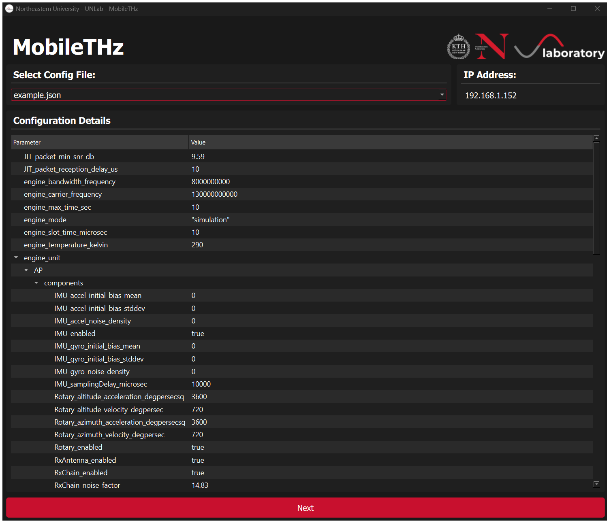
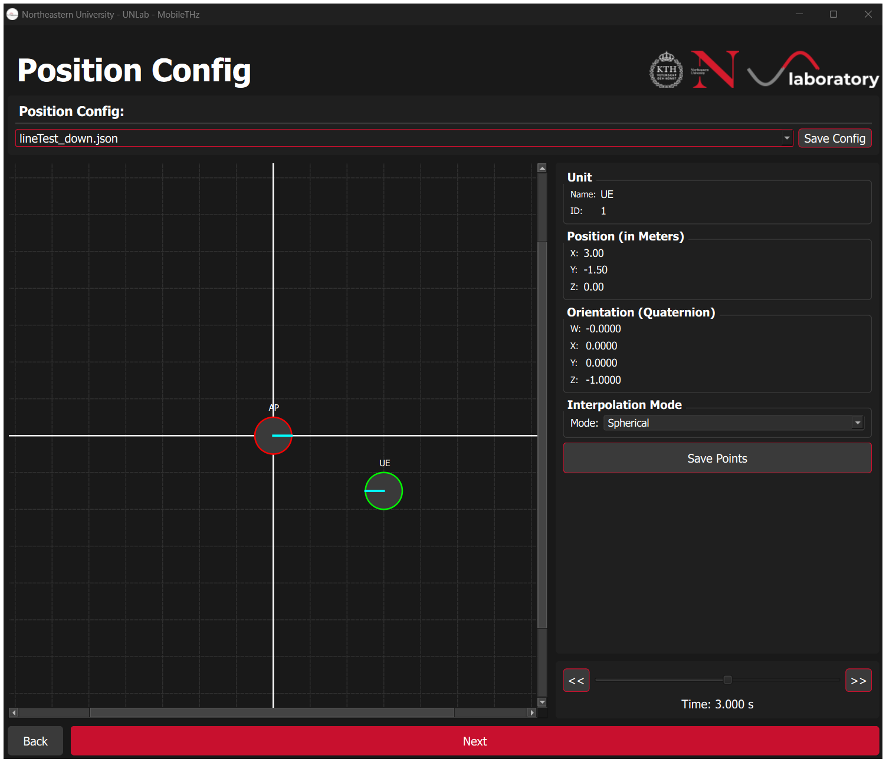
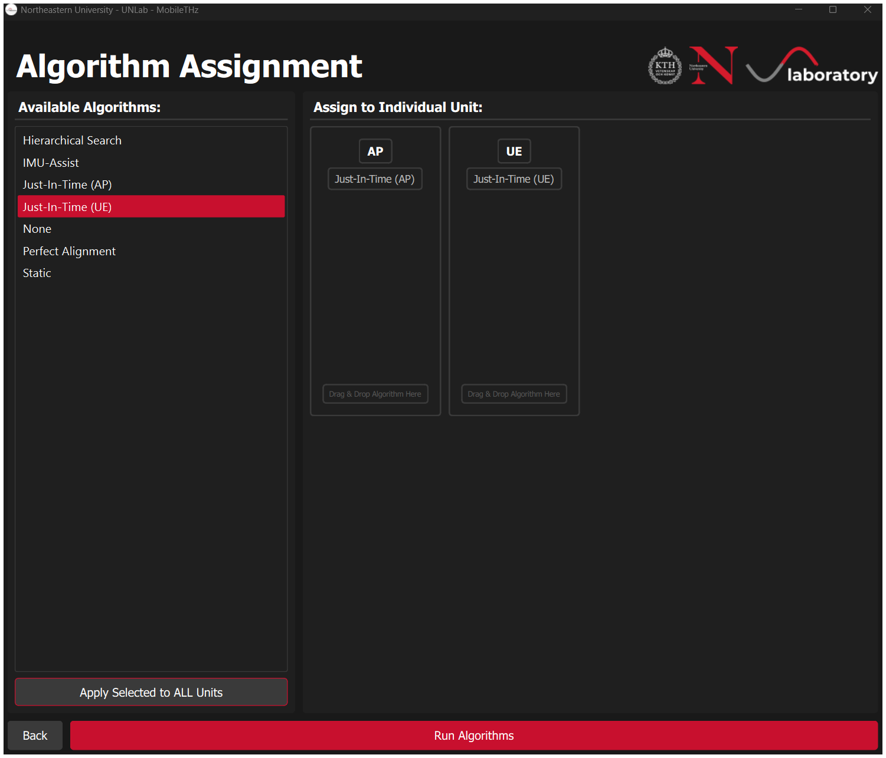
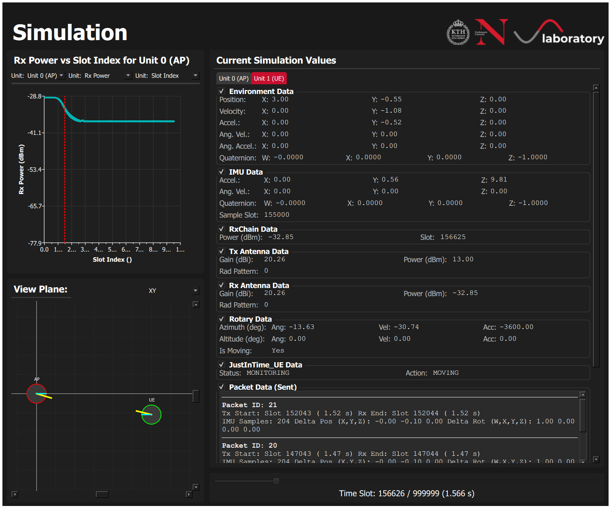

# MobileTHz: Simulation and Hardware-in-the-Loop Platform for Mobile Sub-THz Communications

**MobileTHz** is an integrated simulation and Hardware-in-the-Loop (HIL) platform for evaluating beam management algorithms in mobile sub-Terahertz (sub-THz) communication systems.

## Overview

The platform implements the following algorithms:

| Algorithm               | Description                                                                                                                                      |
| ----------------------- | ------------------------------------------------------------------------------------------------------------------------------------------------ |
| **Hierarchical Search** | Reactive spiral-based beam recovery triggered on power drop; no IMU assistance.                                                                  |
| **IMU-Assist**          | Reactive recovery that uses on-device IMU data to predict the new line-of-sight direction before searching.                                      |
| **JIT (Just-in-Time)**  | Hybrid proactive + reactive algorithm that fuses RF and IMU data to preemptively realign beams via compact control frames _before_ link failure. |
| **Static**              | No realignment (lower-bound reference).                                                                                                          |
| **Perfect Alignment**   | Oracle-based continuous perfect alignment (upper-bound reference).                                                                               |

## Getting Started

### Prerequisites

**Windows:**
Run the `setupWindows.ps1` script to install dependencies and configure the environment.

**Linux:**
Install the required Qt development libraries (e.g., `qtbase5-dev`, `qtcharts5-dev` on Debian/Ubuntu) and a C++17 compliant compiler (g++ or clang++).

### Building

> **You must compile with Qt Creator** (tested with version 6.9.2).

#### Build System

**CMake (Recommended):** Configure your `CMakeLists.txt` to build the project.

**qmake:** Configure your `.pro` file.

#### DSO Integration (Windows Only)

The application can optionally interface with Digital Storage Oscilloscope (DSO) hardware via VISA drivers for HIL measurements. Experimental setup: (Keysight DSOZ632A oscilloscope, VDI MixAMC up/downconverters, WR-6.5 conical horn antennas).

```cmake
if(WIN32)
    target_compile_definitions(YourTargetName PRIVATE ENABLE_DSO=1)
else()
    target_compile_definitions(YourTargetName PRIVATE ENABLE_DSO=0)
endif()
```

### Running

#### GUI Mode

Launch the compiled binary directly:

```bash
./MobileTHz          # Linux/macOS
.\MobileTHz.exe      # Windows
```

The GUI guides you through a multi-step workflow:

**1. Configuration Selection** — Select a JSON config file and review all loaded parameters (engine settings, unit components, IMU noise, etc.).



**2. Position Configuration** _(Simulation only)_ — Place AP and UE nodes on a 2D grid, set positions (in meters), orientations (as quaternions), and interpolation mode. Navigate keyframes with the timeline slider.



**3. Algorithm Assignment** — Select from the available algorithms and drag-and-drop to assign them independently to the AP and UE. Use "Apply Selected to ALL Units" for quick assignment.



**4. Simulation / Experiment** — Monitor the run: Rx power plot, per-unit environment/IMU/RxChain/antenna/rotary data, JIT algorithm state, and transmitted control frame logs. An XY/YZ/ZX spatial view tracks node positions and pointing directions.



#### Console Mode (Simulation Only)

Console mode runs simulations non-interactively using presets from a JSON configuration file.

Requirements:

```bash
./MobileTHz -c path/to/your_config.json          # Linux/macOS
.\MobileTHz.exe -c path\to\your_config.json      # Windows
```

The application will:

1. Load and validate the configuration file.
2. Apply presets for antenna, position, and algorithm.
3. Run the simulation.
4. Output KPIs to a timestamped CSV file (e.g., `OutputKPIs/your_config_YYYYMMDD_HHMMSS_KPIs.csv`).
5. Exit with code 0 (success) or 1 (error).

## Configuration Reference

Configuration files are JSON format, placed in the directory specified by `CONFIG_PARAMETER_DIR` (default: `./ConfigFiles/Parameter`).

### Example Configuration

```json
{
  "display_mode": "GUI",
  "engine_mode": "SIMULATION",
  "engine_slot_time_microsec": 10000.0,
  "engine_max_time_sec": 5.0,
  "engine_carrier_frequency": 140000000000,
  "pixelsPerMeter": 50,
  "engine_unit": [
    {
      "label": "BaseStation",
      "components": {
        "IMU_enabled": false,
        "RxChain_enabled": false,
        "RxAntenna_enabled": false,
        "TxAntenna_enabled": true,
        "Rotary_enabled": false
      },
      "simulation": {
        "preset_antenna_enabled": true,
        "preset_antenna_file": "horn_antenna_140GHz_10dBi.json",
        "preset_position_enabled": true,
        "preset_position_file": "bs_static.json",
        "preset_algorithm_enabled": true,
        "preset_algorithm_name": "none",
        "TxAntenna_transmitPower_dBm": 20
      }
    },
    {
      "label": "MobileUnit",
      "components": {
        "IMU_enabled": true,
        "RxChain_enabled": true,
        "RxAntenna_enabled": true,
        "TxAntenna_enabled": false,
        "Rotary_enabled": true,
        "Rotary_azimuth_velocity": 30.0,
        "Rotary_azimuth_acceleration": 90.0,
        "Rotary_altitude_velocity": 20.0,
        "Rotary_altitude_acceleration": 60.0
      },
      "simulation": {
        "preset_antenna_enabled": true,
        "preset_antenna_file": "ula_8x8_140GHz_15dBi.json",
        "preset_position_enabled": true,
        "preset_position_file": "ue_linear_motion.json",
        "preset_algorithm_enabled": true,
        "preset_algorithm_name": "SCAN",
        "IMU_processingDelay_ms": 5.0,
        "RxChain_processingDelay_ms": 2.0
      }
    }
  ],
  "imu_accel_noise_std": 0.01,
  "imu_gyro_noise_std": 0.001,
  "imu_accel_bias_std": 0.0001,
  "imu_gyro_bias_std": 0.00001,
  "dso_LO_frequency": 140000000000,
  "dso_IF_frequency": 1000000000,
  "dso_measurement_bandwidth": 10000000,
  "dso_mode": "Disabled",
  "rotary_table_port": "COM3",
  "tcp_role": "RX",
  "tcp_searching_sec": 5.0,
  "tcp_tx_ip": "127.0.0.1",
  "tcp_tx_port": 8888,
  "tcp_rx_ip": "0.0.0.0",
  "tcp_rx_port": 8888,
  "max_stopover_threshold": -2.0,
  "min_stopover_threshold": -30.0
}
```

### Parameter Reference

#### Core Engine

| Parameter                   | Type          | Description                                                               |
| --------------------------- | ------------- | ------------------------------------------------------------------------- |
| `display_mode`              | `string`      | `"GUI"` or `"CONSOLE"`. Forced to `"CONSOLE"` when using `-c` flag.       |
| `engine_mode`               | `string`      | `"SIMULATION"` or `"EXPERIMENTAL"`. Console mode requires `"SIMULATION"`. |
| `engine_slot_time_microsec` | `long double` | Simulation time-slot duration in µs. Minimum is 1 µs slot.                |
| `engine_max_time_sec`       | `long double` | Maximum simulation duration in seconds.                                   |
| `engine_carrier_frequency`  | `int64_t`     | Carrier frequency in Hz (e.g., `130000000000` for 130 GHz).               |
| `pixelsPerMeter`            | `int`         | GUI visualization scale factor. Default: 10.                              |

#### Engine Units (`engine_unit` array)

Each unit (AP or UE) has:

**Components:**

| Parameter                                 | Type     | Description                                         |
| ----------------------------------------- | -------- | --------------------------------------------------- |
| `IMU_enabled`                             | `bool`   | Enable IMU (required for IMU-Assist on UEand JIT ). |
| `RxChain_enabled`                         | `bool`   | Enable receive chain.                               |
| `RxAntenna_enabled` / `TxAntenna_enabled` | `bool`   | Enable Rx/Tx antenna.                               |
| `Rotary_enabled`                          | `bool`   | Enable controllable rotary stage.                   |
| `Rotary_azimuth_velocity`                 | `double` | Max azimuth speed (°/s).                            |
| `Rotary_azimuth_acceleration`             | `double` | Max azimuth acceleration (°/s²).                    |
| `Rotary_altitude_velocity`                | `double` | Max altitude speed (°/s).                           |
| `Rotary_altitude_acceleration`            | `double` | Max altitude acceleration (°/s²).                   |

**Simulation presets:**

| Parameter                     | Type      | Description                                                                                                                                             |
| ----------------------------- | --------- | ------------------------------------------------------------------------------------------------------------------------------------------------------- |
| `preset_antenna_enabled`      | `bool`    | Use antenna file preset. Required `true` for console mode.                                                                                              |
| `preset_antenna_file`         | `string`  | Antenna pattern file.                                                                                                                                   |
| `preset_position_enabled`     | `bool`    | Use position trajectory preset. Required `true` for console mode.                                                                                       |
| `preset_position_file`        | `string`  | Trajectory keyframe file .                                                                                                                              |
| `preset_algorithm_enabled`    | `bool`    | Use algorithm preset. Required `true` for console mode.                                                                                                 |
| `preset_algorithm_name`       | `string`  | Algorithm: `"HierarchicalSearch"` (Hierarchical Search), `"IMUAssist"` (IMU-Assist), `"JustInTime_UE/JustInTime_AP"`, `"Static"`, `"PerfectAlignment"`. |
| `IMU_processingDelay_ms`      | `double`  | Simulated IMU processing delay (ms).                                                                                                                    |
| `RxChain_processingDelay_ms`  | `double`  | Simulated Rx chain processing delay (ms).                                                                                                               |
| `TxAntenna_transmitPower_dBm` | `int64_t` | Transmit power in dBm.                                                                                                                                  |

#### IMU Noise Model

These parameters configure the stochastic IMU sensor model (bias random walk + white noise).

| Parameter             | Type          | Description                                   |
| --------------------- | ------------- | --------------------------------------------- |
| `imu_accel_noise_std` | `long double` | Accelerometer noise density (m/s²/√Hz).       |
| `imu_gyro_noise_std`  | `long double` | Gyroscope noise density (rad/s/√Hz).          |
| `imu_accel_bias_std`  | `long double` | Accelerometer bias random walk step std. dev. |
| `imu_gyro_bias_std`   | `long double` | Gyroscope bias random walk step std. dev.     |

#### DSO Configuration (HIL only)

| Parameter                   | Type      | Description                                               |
| --------------------------- | --------- | --------------------------------------------------------- |
| `dso_mode`                  | `string`  | `"Enabled"` or `"Disabled"`. Windows only.                |
| `dso_LO_frequency`          | `int64_t` | Local oscillator frequency (Hz). Usually matches carrier. |
| `dso_IF_frequency`          | `int64_t` | Intermediate frequency (Hz).                              |
| `dso_measurement_bandwidth` | `int64_t` | Measurement bandwidth (Hz).                               |

#### Rotary, TCP, and Stopover

| Parameter                     | Type          | Description                                               |
| ----------------------------- | ------------- | --------------------------------------------------------- |
| `rotary_table_port`           | `string`      | Serial port (e.g., `"COM3"`, `"/dev/ttyUSB0"`).           |
| `tcp_role`                    | `string`      | `"TX"` or `"RX"`.                                         |
| `tcp_searching_sec`           | `long double` | Connection search timeout (s).                            |
| `tcp_tx_ip` / `tcp_rx_ip`     | `string`      | Destination / listen IP address.                          |
| `tcp_tx_port` / `tcp_rx_port` | `int`         | Destination / listen port.                                |
| `max_stopover_threshold`      | `long double` | Max power drop (dB) from optimal before halting movement. |
| `min_stopover_threshold`      | `long double` | Min relative power level (dB) for stopover logic.         |

> **Note:** String parameters (`engine_mode`, `tcp_role`, etc.) are case-sensitive. Booleans must be lowercase `true`/`false`.

---

> _By: Sergey Petrushkevich_
